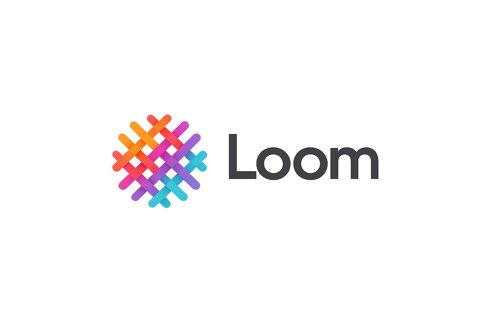

## Goals

- **Fine-tuning** — End-to-end training for LLMs and Hugging Face models with reproducible configs and experiments.
- **Orchestration** — API-driven workflows (Temporal activities and subprocess runners) so heavy training stays out of the worker process.
- **Evaluation** — Automated benchmarks, regression checks, and prompt-based LLM evaluation.
- **Tracking** — MLflow for parameters, metrics, artifacts, and dataset versions; object storage for models and data.
- **Operations** — Centralized logging, Temporal retries, and room to grow into sweeps, multi-GPU runs, and full reproducibility.
